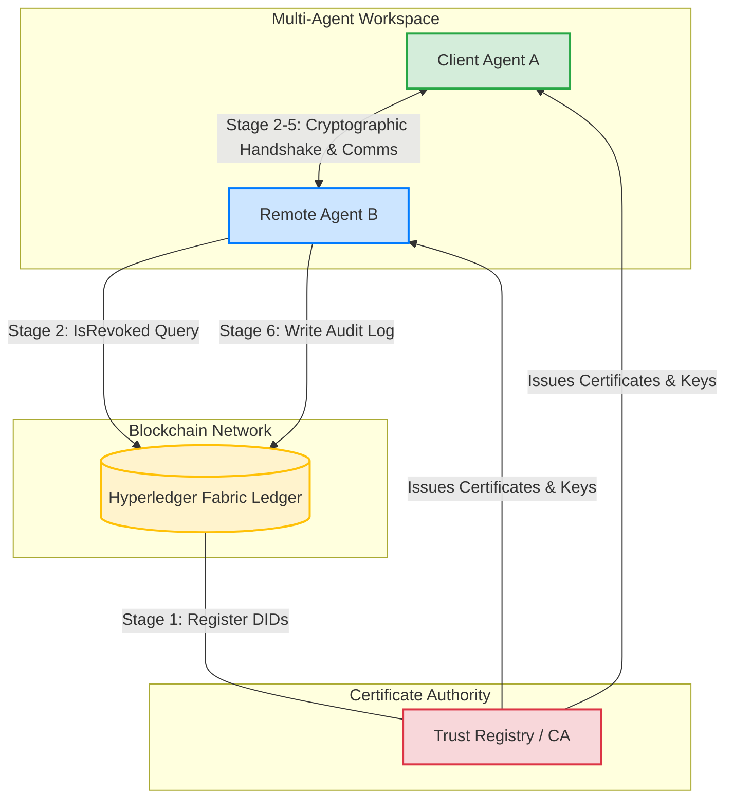

# BSAAP: Blockchain-Integrated Secure Agent-to-Agent Authentication Protocol for Multi-Agent AI Systems

---

## 1. Project Information
* **Research Program:** Summer Research Internship Program (SRIP-2026)
* **Institution:** Goa Institute of Management (GIM), Sanquelim, Goa
* **Intern:** Karthik V. (M.Tech AI/ML, GIM)
* **Faculty Mentor:** Dr. Anup Kumar Maurya (Assistant Professor, Big Data Analytics Department, GIM)
* **Submission Date:** June 30, 2026

---

## 2. Objectives
As Large Language Model (LLM)-based autonomous agents become central to software ecosystems, inter-agent communication security is paramount. Current standard authentication frameworks (PKI, OAuth 2.0, JWT) are designed for human-to-service or human-to-human workflows. They do not account for the autonomous, ephemeral, and dynamically delegated nature of modern multi-agent systems.

To address this, our research established the following objectives:
1. **Design a Dedicated A2A Protocol:** Create the *Blockchain-Integrated Secure Agent-to-Agent Authentication Protocol* (BSAAP) to achieve mutual authentication, session key secrecy, perfect forward secrecy, replay resistance, and capability confinement.
2. **Anchor Trust on Permissioned Ledger:** Use Hyperledger Fabric to store Decentralized Identifiers (DIDs) for agents, enabling smart-contract-enforced certificate revocation check without CRL polling overhead.
3. **Cryptographic Capability Scoping:** Embed allowed capability constraints inside X.509 v3 certificates using custom OID extensions, preventing unauthorized task execution.
4. **Develop and Benchmark a Prototype:** Build a Python prototype implementing the cryptographic stack (ECDSA P-256, X25519, AES-256-GCM, and HKDF-SHA-256) and FastAPI endpoints, evaluating performance and attack detection under 100 trials.
5. **Conduct Rigorous Formal Analysis:** Verify the cryptographic logic mathematically using game-based reductions and automatically under the Dolev-Yao threat model using the AVISPA verification suite.

---

## 3. Methodology

The BSAAP architecture features a hybrid cryptographic framework combined with decentralized ledger checks. The architecture is detailed below.

### A. System Architecture Overview



---

### B. The Six Protocol Stages

The interaction sequence across all six protocol stages is visualized in the sequence diagram below:

```mermaid
sequenceDiagram
    autonumber
    actor A as Agent A (Client)
    actor B as Agent B (Remote)
    participant CA as Trust Registry (CA)
    participant L as Fabric Ledger (L)

    Note over A,B: Stage 1: Registration & Anchoring
    A->>CA: Submit identity keys & metadata
    B->>CA: Submit identity keys & metadata
    CA->>L: Anchor Agent DIDs (RegisterAgent txn)
    CA-->>A: Return X.509 v3 Certificate (with OID capabilities)
    CA-->>B: Return X.509 v3 Certificate (with OID capabilities)

    Note over A,B: Stage 2: Authentication Request
    A->>B: M1: Send AuthRequest (n1, t1, certA, c, eKA, sigA)
    activate B
    B->>L: Invoke IsRevoked(didA) query
    L-->>B: Revocation Status (False/Valid)
    Note over B: Performs verification (Freshness, Nonce, CN, Capability OID)
    
    Note over A,B: Stage 3: Challenge-Response Verification
    B->>A: M2: Challenge (cB, n2, certB, sigB)
    Note over A: Verifies B's signature (MITM check)
    A->>B: M3: Challenge Response (r, idA)
    Note over B: Verifies response r (Proof of Private Key Possession)
    deactivate B

    Note over A,B: Stage 4: Ephemeral Key Exchange & Derivation
    A->>B: Exchange ephemeral public key eKA
    B->>A: Exchange ephemeral public key eKB
    Note over A,B: Both derive Ks = HKDF-SHA-256(SS, n1||n2)
    Note over A,B: Securely erase ekA, ekB, and SS from memory

    Note over A,B: Stage 5: Secure Application Session
    A<->>B: Encrypted Payload Exchange (AES-256-GCM + HMAC-SHA-256)

    Note over A,B: Stage 6: Termination & Ledger Audit
    B->>L: Write audit log record (Ri, hi) via Merkle Chain
```

---

### C. Stage 2 Request Verification Flowchart

To guarantee secure onboarding, Agent B runs seven logical validations on the client's request. The process flow is shown below:

```mermaid
graph TD
    Start[Receive Stage 2 Request M1] --> Fresh{Freshness Check?<br>|t1 - tnow| <= 5s}
    Fresh -- No --> Abort[Abort Handshake & Log]
    Fresh -- Yes --> Replay{Seen Nonce?<br>n1 in Nseen}
    Replay -- Yes --> Abort
    Replay -- No --> Cert{Cert Signature Valid?<br>Verify CA Chain}
    Cert -- No --> Abort
    Cert -- Yes --> Revoke{On-chain Revoked?<br>IsRevoked didA}
    Revoke -- Yes --> Abort
    Revoke -- No --> Sig{Sig Valid?<br>Verify payload2}
    Sig -- No --> Abort
    Sig -- Yes --> CN{Common Name Match?<br>CN == idA}
    CN -- No --> Abort
    CN -- Yes --> Cap{Capability Check?<br>c in OID caps}
    Cap -- No --> Abort
    Cap -- Yes --> Proceed[Proceed to Challenge-Response Stage 3]

    style Abort fill:#f8d7da,stroke:#dc3545,stroke-width:1px
    style Proceed fill:#d4edda,stroke:#28a745,stroke-width:2px
```

---

## 4. Key Findings

The empirical evaluation of our Python 3.12 implementation under 100 trials on an Intel Xeon 2.8 GHz testbed yielded high-performance metrics and validated our security architecture.

### A. Performance and Latency Metrics

Computational latency for key stages of the protocol was measured as follows:

| Protocol Stage / Primitive | Mean Latency (ms) | Standard Deviation ($\pm$ ms) | Description |
| :--- | :--- | :--- | :--- |
| **Full Authentication Handshake** | **1.118** | **0.279** | **Total latency (Stage 2 to Stage 4)** |
| Certificate Verification | 0.154 | 0.024 | X.509 v3 structure and signature validation |
| Signature Verification | 0.081 | 0.011 | ECDSA P-256 signature check |
| Session Key Derivation | 0.090 | 0.015 | HKDF-SHA-256 extraction and expansion |
| Agent Registration (Stage 1) | 0.278 | 0.037 | Key pair generation and CA signing |
| Challenge Generation (Stage 3a) | 0.037 | 0.012 | Challenge creation and ECDSA signing |
| AES-256-GCM Encryption | 0.005 | 0.002 | Payload encryption (256-byte message) |
| Message Verification (Stage 5) | 0.008 | 0.003 | Tag decryption and HMAC sequence validation |
| Fabric Query (Simulation) | 0.001 | 0.001 | Local lookup for revocation check |

### B. Scalability Benchmarks

We compared BSAAP against the standard OAuth 2.0 token introspection baseline (as reported in multi-agent literature) across varying concurrent agent populations:

```
Concurrent Agent Pairs vs Authentication Latency (ms)

  Latency (ms)
   |
60 |                                                  [OAuth 2.0: 55.8 ms]
50 |                                                       /
40 |                                                      /
30 |                                               /
20 |                                         /
10 |                                   /
 0 |---[BSAAP: 1.12 ms]-------[BSAAP: 5.92 ms]--------------------------------
   +------------------------------------------------------------+
   1                                                          100
                      Concurrent Agent Pairs
```
* **Linear Scaling:** At 100 concurrent agent pairs, BSAAP completes verification in **5.92 ms** (excluding network latency), outperforming the OAuth 2.0 introspection baseline (**55.8 ms**) by **9.4$\times$**.
* **Simulation Boundaries:** While the simulated Fabric client runs queries in 0.001 ms, a production Fabric ledger adds 12–18 ms per query. Incorporating production Fabric endorsement delays leads to a projected full-authentication latency of **37–55 ms**.

### C. Formal Verification and Adversary Simulation
* **AVISPA Security Result:** Both OFMC and CL-AtSe backends evaluated the modeled protocol and returned **`SUMMARY: SAFE`**, proving mathematically that there are no replay or MITM vulnerabilities in the handshake phase.
* **100% Attack Detection Rate:** The test suite demonstrated 100% detection and prevention across the 5 threat classes:
  1. *Replay:* Blocked by nonce caches and timestamps.
  2. *Impersonation:* Blocked by ECDSA signature validation and Subject DN verification.
  3. *Expiry:* Blocked by validity checks in certificates and session tokens.
  4. *Tampering:* Blocked by GCM authentication tags and HMAC tags.
  5. *Capability Escalation:* Blocked by certificate OID capability scope checks.
* **Cryptographic Bound:** The ROR-model session key secrecy is bounded by:
  $$\mathrm{Adv}^{\mathrm{ror}}_{\mathrm{BSAAP}}(\mathcal{ADV}) \leq 2 \cdot \mathrm{Adv}^{\mathrm{ECDDH}}(\mathcal{B}) + \frac{q_h}{2^{256}}$$

---

## 5. Conclusion
Our Summer Research Internship Program successfully designed, implemented, and verified **BSAAP**, a lightweight and secure agent-to-agent authentication protocol. The framework solves the core challenges of autonomous agent interaction by wrapping capability scoping in X.509 certificate extensions, establishing forward-secret session keys (X25519 + HKDF), and logging session events to a simulated blockchain ledger using Merkle chains. 

With an authentication latency of **1.118 ms**, BSAAP proves that agent security can be enforced locally with near-zero overhead, well below typical LLM inference times.

---

## 6. Future Work
For future development, the following work is planned:
1. **Physical Ledger Integration:** Deploy BSAAP on a real multi-node Hyperledger Fabric network to benchmark network-bound endorsement latency.
2. **Secure Enclave Integration:** Store private keys in Trusted Execution Environments (TEEs) or TPM-backed secure key hardware.
3. **Cross-Domain DID Resolution:** Extend the Trust Registry to support federated CA hierarchies and cross-ledger DID lookup.
4. **Expanded Protocol Proofs:** Build a complete ProVerif Dolev-Yao model to cover all six stages of the protocol.
5. **Persistent Nonce Cache:** Replace the in-memory cache with a low-latency Redis database for persistent replay protection.
6. **Post-Quantum Cryptography:** Migrate the signature mechanisms to CRYSTALS-Dilithium to defend against future quantum decryption threats.

---

## 7. References
1. M. Xu et al., “AgentDID: Trustless Identity Authentication for AI Agents,” *arXiv preprint arXiv:2604.25189*, Apr. 2026.
2. A. Goswami, “Agentic JWT: A Secure Delegation Protocol for Autonomous AI Agents,” *arXiv preprint arXiv:2509.13597*, Sep. 2025.
3. Z. Lin et al., “Binding Agent ID: Unleashing the Power of AI Agents with Accountability and Credibility,” *arXiv preprint arXiv:2512.17538*, Dec. 2025.
4. K. Huang et al., “A Novel Zero-Trust Identity Framework for Agentic AI: Decentralized Authentication and Fine-Grained Access Control,” *arXiv preprint arXiv:2505.19301*, May 2025.
5. G. Syros et al., “SAGA: A Security Architecture for Governing AI Agentic Systems,” in *Proc. NDSS Symp. 2026*, Feb. 2026.
6. S. Prakash, “AIP: Agent Identity Protocol for Verifiable Delegation Across MCP and A2A,” *arXiv preprint arXiv:2603.24775*, ISB, Mar. 2026.
7. Z. Zou et al., “BlockA2A: Towards Secure and Verifiable Agent-to-Agent Interoperability,” *arXiv preprint arXiv:2508.01332*, Tsinghua University, Aug. 2025.
8. E. Androulaki et al., “Hyperledger Fabric: A Distributed Operating System for Permissioned Blockchains,” in *Proc. EuroSys '18*, pp. 30:1–30:15, 2018.
9. M. Fersch et al., “On the Provable Security of (EC)DSA Signatures,” in *Proc. CCS '16*, pp. 1651–1662, 2016.
10. A. Armando et al., “The AVISPA Tool for the Automated Validation of Internet Security Protocols and Applications,” in *Proc. CAV 2005*, LNCS 3576, pp. 281–285, 2005.
